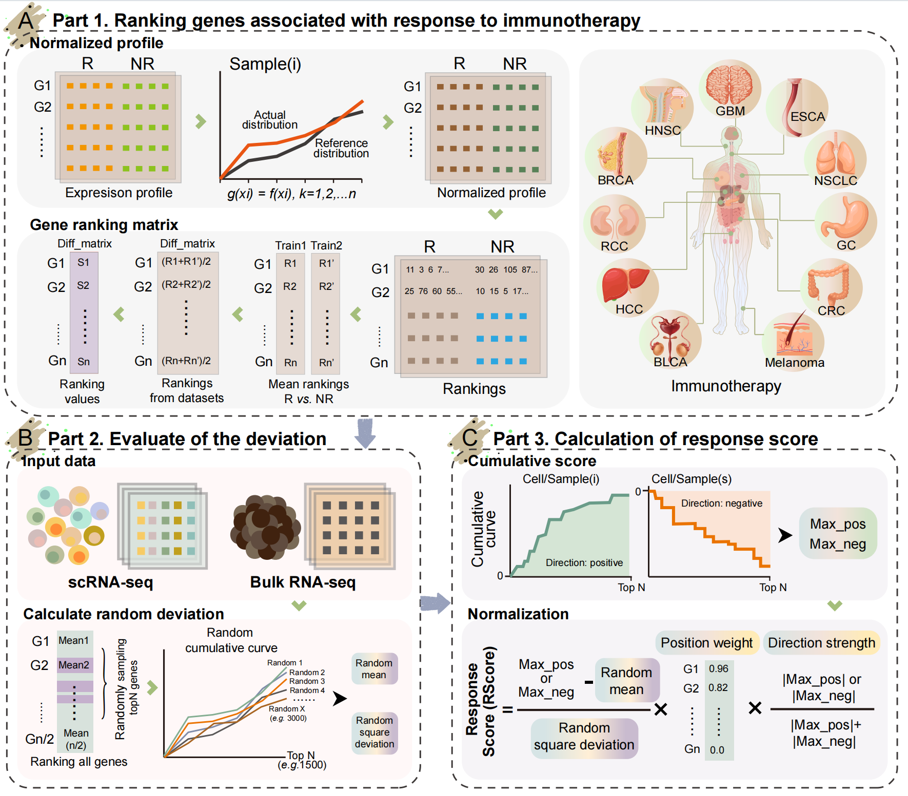
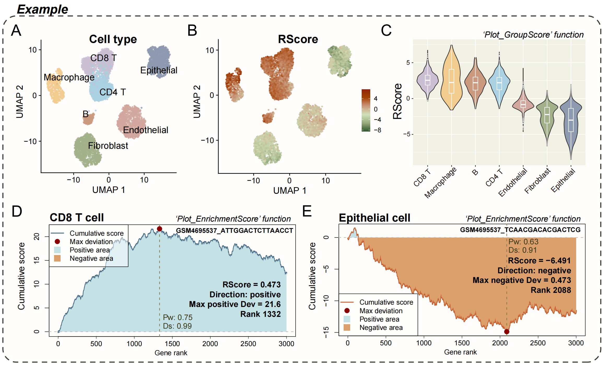

# scResponse
**scResponse** is an R package for computing and visualizing
response-related enrichment scores based on gene expression matrices.

*Overview of the scResponse workflow.*

---
## Features

- Compute response-related enrichment scores for each analysis unit
  (e.g. single cells or spatial spots)
- Visualize enrichment score curves for individual units
- Compare score distributions across predefined groups
- Cancer-specific pre-trained gene differential weights

---
## Installation
**scResponse** is available on github, you can install it by:
```R
library(devtools)
install_github("dongqi777/scResponse")
```
---
## Input data
Most functions in **scResponse** operate on a numeric expression matrix:

-   Rows: genes
-   Columns: analysis units  
    (e.g. cells in single-cell data, spots in spatial transcriptomics)
   
Metadata-based visualization functions require a corresponding  
data.frame with one row per analysis unit.

---
## Usage
```R
library(scResponse)
# Expression matrix:genes x analysis units
mat <- GetAssayData(seurat_obj, slot = "counts")

# Response_Score:compute response score for all units
scores <- Response_Score(mat, cancer = "BC")

# Plot_EnrichmentScore:visualize enrichment curve for a single unit
Plot_EnrichmentScore(mat, cell_id = colnames(mat)[1], cancer = "BC")
```
Visualization of group-wise scores
```R
meta <- seurat_obj@meta.data
Plot_GroupScore(
  meta,
  group = "CellType",
  value = "RScore",
  fill  = "Response"
)
```
*Example outputs generated by scResponse.*


---
## Notes
-   scResponse does not depend on a specific single-cell framework.
-   Users are responsible for providing appropriately normalized or  comparable expression matrices.
-   Currently supported cancer codes include:
`NSCLC`, `MEL`, `HCC`, `BLCA`, `RCC`, `BC`, `GC`, `ESCA`, `HNSC`, `GBM`, `CRC`
 ---
 ## License
 MIT License
